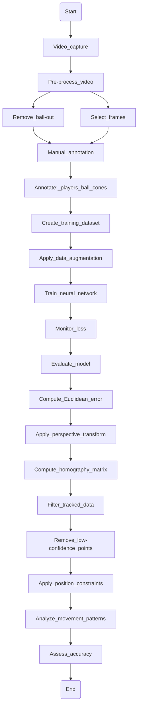

# Application of the DeepLabCut Toolbox in Sports: A Deep Learning Approach

Apolinário-Souza, T., Bedo, B. L. S., Leonardi, T. J. Application of the DeepLabCut toolbox in sports: a Deep Learning approach. 2024

## This repository contains the online materials for the article

[Original video](https://github.com/apolinario-souza/DeepLabCut_sports/blob/main/hand.mp4)

[Video with DeepLabCut](https://github.com/apolinario-souza/DeepLabCut_sports/blob/main/Game-hand-2024-08-11/videos/handDLC_resnet50_GameAug11shuffle1_5000_labeled.mp4)

[Tutorial video 1](https://youtu.be/7Prv_8zBTi4)

[Script 1](https://github.com/apolinario-souza/DeepLabCut_sports/blob/main/script_1.py)

[How to Install DeepLabCut](https://github.com/apolinario-souza/DeepLabCut_sports/blob/main/How_to_Install_DeepLabCut.pdf)

[Script 2](https://github.com/apolinario-souza/DeepLabCut_sports/blob/main/script_2.ipynb)

[Script 3](https://github.com/apolinario-souza/DeepLabCut_sports/blob/main/script_3.ipynb)

# Flowchart of the Implementation of the DeepLabCut Algorithm

